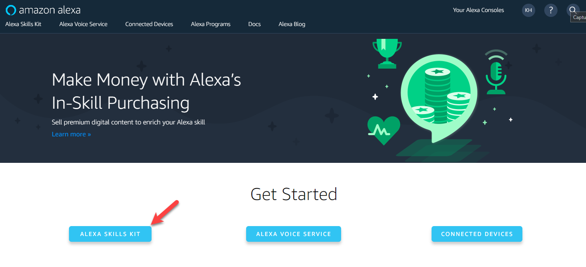

- - -
# Under Construction 
- - -

# How to Get Azure IoT Hub to work with Amazon Alexa Skills

This guide is the result of a project that I worked with a customer on.  The customer wanted to connect an Amazon Alexa skill to Azure IoT Hub to perform some "action".  The short answer here is that you can achieve this...but the longer response is the "how".  I am creating this to address the "how" and I hope that you enjoy the article.

#### <u> Assumptions</u>
To start out I need to make a few assumptions: 
1. That you have access to an Azure Subscription 
2. That you have configured an Azure IoT Hub in the Azure Subscription

- - - 
## Configure the Amazon Alexa Service (Skills)
The first step here is to log into the [Azure Development portal](https://developer.amazon.com/)

 

