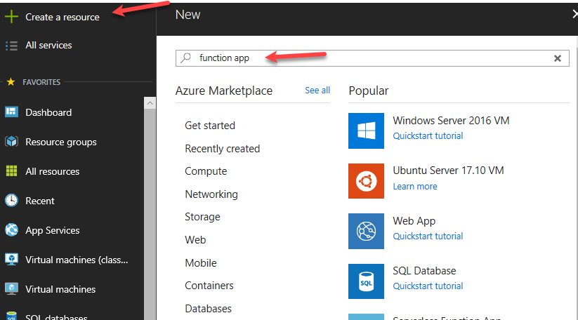

Under Construction
- - - 

# How to Get Azure IoT Hub to work with Amazon Alexa Skills

This guide is the result of a project that we worked with a customer on.  The customer wanted to connect an Amazon Alexa skill to Azure IoT Hub to perform some "action".  The short answer here is that you can achieve this...but the longer response is the "how".  We are creating this to address the "how" and we hope that you enjoy the article.

#### <u> Assumptions</u>
To start out we need to make a few assumptions: 
1. That you have access to an Azure Subscription 
2. That you have configured an Azure IoT Hub in the Azure Subscription

- - - 
## Configure the Amazon Alexa Service (Skills)
The first step here is to log into the [Azure Development portal](https://developer.amazon.com/)

 
 
By clicking on Alexa skill kit, you start this process.
Then you will need to click on "Start a Skill"

 
 
Click on "Create Skill"

 
 
Now you should see the following page.  Here you will give your skill a name and select the default language.

 

You will then have a selection of different skill types.  For this tutorial we will select "Custom"

 

After you select the custom skill click on the "Create Skill" button.

This will take us to the Alexa Skill build page where we can start building out our Alexa Skill.

 
 
The invocation name is how the user will call the skill.  Our next step is to define this invocation name.  Keep in mind that this is how the user will call up the Alexa Skill.  For example you are building a Skill for measuring the amount of moisture in soil, you might want your users to ask Alexa something like "Alexa ask my soil how moist it is."  In this case the invocation name would be "my soil".

Click on the invocation on the left hand side of the skill builder.

 
 
From here enter your invocation name
 
Always remember to save your skill model!

 
 
Next on the list is to define the skill intent.  An intent represents an action that fulfills a user's spoken request.  On the left hand side click "Intents" (There are 4 default intents) and then click "Add".

 
 
On the right click the "Add Intent" button.  

 
 
For our purposes we will be turning on and off LED's so our intent will be called "turnlightonoff".

 
 
Click on "Create custom intent"

 
 
We now need to define the utterances.  An utterance is spoken phrase that activates the intent.  There could be several different ways that a user could ask to turn on or off the LED's.  For the purposes of this document we will just use "turn light" followed by an "Slot".  Once this is filled out click on the "+" at the end of the row.  This would look like the following:

 


Now that we have defined our utterances, we need to create a custom slot type.  To do this we need to click on "Slot Types" on the left hand side and then click the "Add" button.

 
 
Slot types are kind of a "fill in the blank" value.  In our example above we are using "{actions}".  So when creating out slot type we will call it "action".  

 
 
This "action" will have two values (mostly because we want to turn on the LED and turn off the LED).  Enter ON in the "Enter a new value for this slot" box and press the "+" at the end of the row.  Create an Off in the same manner.  In the picture below you can see the slot type "action" set with two values of ON and OFF.  This also matches our Arduino functions...you will see that later when we get to that section.  In the "Create custom slot type" type action.
 
 
 
Moving along with the build, we now need to define our endpoint.  Since we will be using Azure IoT Hub to control the LED's we will need to navigate to the "Endpoints" on the left hand side.

 
 
From here we will select the HTTPS endpoint.

 
 
Now let this window sit for a second and open a new window and log into your Azure Portal.
 
This is where it will start to get a little interesting.  We need the Endpoint for our Azure Function App.  From the Azure portal click on the green + "Create a Resource".  In the search field type in "function app".  

 
 
Click on the "Function App"

 
 
Click "Create"

 
 
Fill in the values for the Function App

 
 
Click "Create"

It will take a few moments for the function app to spin up.  Once it completes navigate to the function app and click on the "+" sign next to "functions" as shown blow.

 
 
Click on "Custom Functions:

 ![image(Pictures/19.png)
 
Select HTTP Trigger

 ![image(Pictures/20.png)

On the next blade select C# for the language, git it a name, and leave the authorization level as function.

 ![image(Pictures/22.png)
 
Click "Create"

We will come back later to fill in the function, but for now we just need the URL to the function.  From here we can click on "</> Get Function URL" and this will open up a new window as seen below.

 ![image(Pictures/23.png)
 
Click "Copy" to the right of the URL.

 ![image(Pictures/25.png)
 
Now that we have the URL to the Azure function we can head back to the Amazon Alexa skill builder portal.  We should be looking at the Endpoints page as we left it...and this is where we will pick back up.  Enter the URL value for the Azure Function in the URL section for the HTTPS URL.

 ![image(Pictures/26.png)
 
Once you have entered your Azure Function URL the next step is to select the SSL certificate type.  For this example we will be using the "My development endpoint is a sub-domain of a domain that has a wildcard certificate from a certificate authority" option

 

Over on the left hand side you will see a  as seen below.  Click on that  image and that will open up the files fly out.



Under the "View files" section click the "+Add" button.



In the file name box enter "project.json" without the quotes and press enter.



In the code section enter the following:

```C#
{
	"frameworks":{
     "net46":{
      "Dependencies":
      {"Microsoft.Azure.Devices":"1.6.0"
      }
     }
    }
}
```



And click Save.

Click on the run.csx file.



Replace all this code with the following:
<i>Note that this code is also found in the code directory under the file called Azure_Run_Function.</i>



```C#
using System;
using Microsoft.Azure.Devices;  // need version 1.4 else the Async will not reply
using System.Net;
using System.Threading;
using System.Net.Http;
using Newtonsoft.Json;
using Newtonsoft.Json.Linq;

const string IoTConnectionString = "<IoT Hub connection String>";
const string device = "<IoT Device Name>";
static string responseText = "";
static string intentAction = "";
static ServiceClient serviceClient; 
public static async Task<HttpResponseMessage> Run(HttpRequestMessage req, TraceWriter log)
{
    dynamic data = await req.Content.ReadAsAsync<object>();
    log.Info($"Content={data}");

    // Set name to query string or body data
    string intentName = data.request.intent.name;
    intentAction = data.request.intent.slots.action.value;
    log.Info($"intentName={intentName}");
    switch (intentName)
    {
        case "turnlightonoff":
            if (intentAction == "on")
            { 
                responseText = "Sure thing Keith.  Let me trun on the light for you.";
            }
            else if (intentAction == "off")
            { 
                responseText = "Sure thing Keith.  Let me turn off the light for you."; 
            }
            else 
            {
                responseText = "I am not sure of what just happened.";
            }
        break;
        default: 
            responseText = "Keith I am unsure of your intent.";
            break;
    }
        light(log);
        
        return req.CreateResponse(HttpStatusCode.OK, new {
            version = "1.1",
            sessionAttributes = new { },
            response = new
                {
                    outputSpeech = new
                    {
                        type = "PlainText",
                        text = responseText
                    },
                    shouldEndSession = true
                }
            }); 
    
    

}
public static async void light(TraceWriter log)
{
        serviceClient = ServiceClient.CreateFromConnectionString(IoTConnectionString);
        var commandMessage = new Message(System.Text.Encoding.ASCII.GetBytes(intentAction.ToUpper()));
        // send the command to the device
        await serviceClient.SendAsync(device, commandMessage);  

}

```
And then click save.

Now the Azure Function is setup for the incoming messages from the Alexa skill.  

## Connecting our device to the Auzre IoT Hub
- - - 
We will need to create a virtual device in the IOT Hub for the physical device to connect to.  Once again...let's go back in the Azure portal and navigate to the resource group that we are using for this project. Select the IoT Hub.  Once the IoT Hub blade opens up navigate to the click on IoT Devices on the left hand side.

 

Click on the "+Add" button.



Fill in the device name and click save.



After the device is added to the IoT Hub we need to generate a SAS Token for the device.  One of the easiest ways to generate a SAS token for the device is to install the IoT Explorer.  You an download the IoT Explorer from [here](https://github.com/Azure/azure-iot-sdks/releases/download/2016-11-17/SetupDeviceExplorer.msi).  While that is downloading, let's get the IoT Hub Connection string.  To get the IoT Hub Connection string log into the Azure portal.  Navigate to the IoT Hub.  On the left hand side click on the click on the "Shared access policies".

 

Once the flyout opens click on  next to the Connection string—primary key.  This will copy it to clipboard.  Now back to the Device Explorer.

 

Click on the IoT Hub Owner

 

Once you have the device explorer installed start it up and enter the Connection string—primary key that you have on the clipboard in the box as scene below

 

Click on update.

 

Then click on management 

 

Find the device that you created earlier in the list.

 

Once you select the device click on the "SAS Token"

 

Ensure that your device is selected and enter your expiration time and click on generate.

 






 
   


 

 
 



 

 
 




