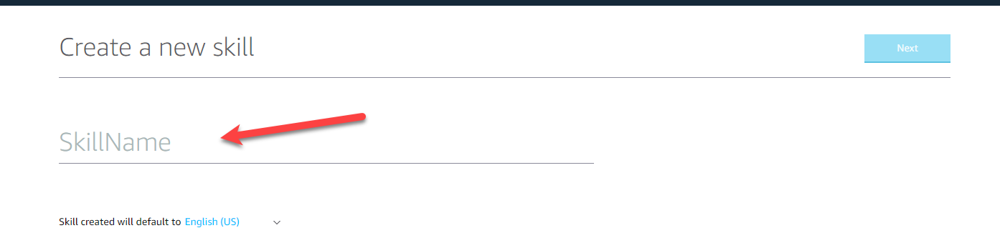
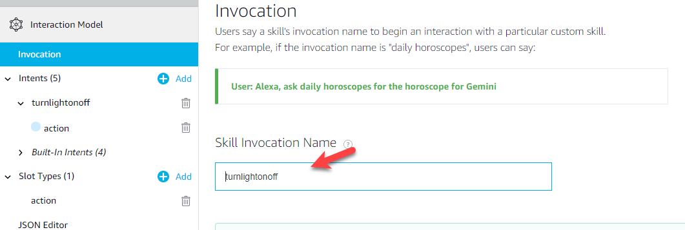

- - -
# Under Construction 
- - -

# How to Get Azure IoT Hub to work with Amazon Alexa Skills

This guide is the result of a project that we worked with a customer on.  The customer wanted to connect an Amazon Alexa skill to Azure IoT Hub to perform some "action".  The short answer here is that you can achieve this...but the longer response is the "how".  We are creating this to address the "how" and we hope that you enjoy the article.

#### <u> Assumptions</u>
To start out we need to make a few assumptions: 
1. That you have access to an Azure Subscription 
2. That you have configured an Azure IoT Hub in the Azure Subscription

- - - 
## Configure the Amazon Alexa Service (Skills)
The first step here is to log into the [Azure Development portal](https://developer.amazon.com/)

 
 
By clicking on Alexa skill kit, you start this process.
Then you will need to click on "start a Skill"

 
 
Click on "Create Skill"

 
 
Now you should see the following page.  Here you will give your skill a name and select the default language.

 

You will then have a selection of different skill types.  For this tutorial we will select "Custom"

 

After you select the custom skill click on the "Create Skill" button.

Now we can start building out our Alexa Skill

 
 
The invocation name is how the user will call the skill.  Our next step is to define this invocation name.

 
 
Always remember to save your skill model!

 
 
Next on the list is to define the skill intent.  An intent represents an action that fulfills a user's spoken request.  For our purposes we will be turning on and off LED's so our intent will be called "turnlightonoff".

 
 
The next step is to define the utterances.  An utterance is spoken phrase that activates the intent.  There could be several different ways that a user could ask to turn on or off the LED's.  For the purposes of this document we will just use "turn light" followed by and "action".  This would look like the following:

 

Next up...we need to create a custom slot types.  Slot types are kind of a "fill in the blank" value.  In our example above we are using "{actions}.  So when creating out slot type we will call it "action".  Now "action" will have two values (mostly because we want to turn on the LED and turn off the LED).  In the picture below you can see the slot type "action" set with two values of ON and OFF.  This also matches our Arduino functions...you will see that later when we get to that section.

 
 

 
 
